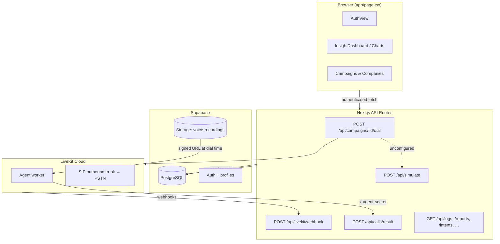

# Agent AVM Interface

Outbound IVR campaign management portal for the South African market. Operators create companies and campaigns, upload contact lists and voice recordings, start outbound dialing, and monitor call outcomes, intent funnels, and spend in real time.

The app is a **Next.js 16** single-page dashboard backed by **Supabase** (PostgreSQL, Auth, Storage) with **LiveKit** as the telephony gateway for real outbound calls. When LiveKit is not configured, a built-in simulator keeps the dashboard usable for demos and development.

---

## What this project does

At a high level, Agent AVM connects four concerns:

1. **Campaign operations** — Create and manage companies, campaigns, contact lists, voice prompts, and dialing settings (time windows, speed, transfer targets).
2. **Outbound dialing** — When an operator presses Play on a running campaign, the app dispatches calls through LiveKit: an AI agent worker joins a room, a SIP participant dials the callee via a LiveKit outbound trunk (Twilio/Telnyx sit behind LiveKit, not in this repo).
3. **Call reporting** — Per-call detail (`call_records`), aggregate campaign counters (`call_logs`), and conversation intent waterfalls (`intent_stats`) feed charts and tables across the dashboard.
4. **Access control & audit** — Invite-only Supabase Auth (password + optional WebAuthn passkeys), role-based UI (`admin` vs `engineer`), and immutable security event logging.



---

## Frontend

The UI is a **client-rendered single page** (`app/page.tsx`) wrapped in MUI theming (`components/Providers.tsx`, `lib/theme.ts`) and EVRA design tokens (`lib/tokens.ts`, `app/globals.css`).

### Shell & navigation

| Component | Role |
|-----------|------|
| `AuthView` | Login gate — password sign-in via Supabase Auth; optional WebAuthn passkey enrollment after first login |
| `Sidebar` / `FloatingNav` / `TopBar` | Primary navigation and layout chrome |
| `TutorialOverlay` | First-run guided tour |

### Main views (selected via sidebar)

| View ID | Component(s) | Purpose |
|---------|--------------|---------|
| `dashboard` | `InsightDashboard`, `KpiStrip`, `InsightCharts` | Control Room — configurable KPI cards, charts, filters by company/campaign/agent/date |
| `sts` | `STSDashboard` | STS-specific metrics view |
| `companies` | Inline in `page.tsx` | Company roster (card/table toggle) |
| `campaigns` | `CampaignModal`, `CampaignActionDialog` | Campaign list, create/edit/reuse/archive, play/pause/stop |
| `reports` | `Charts`, `CampaignDetail` | Aggregate campaign report — outcome donut, funnel, spend |
| `quality` | `CallQuality` | Per-call quality and recording review |
| `security` | `SecurityView` | Security audit log |
| `settings` | `SettingsView` | VoIP providers, system settings |
| `profile` | `ProfileView` | User profile and appearance |

### Data loading pattern

After auth, the page polls backend APIs on an interval (`NEXT_PUBLIC_POLL_INTERVAL_MS`, default **15s**):

- `GET /api/campaigns` — campaign list
- `GET /api/reports` — aggregate counters per campaign
- `GET /api/logs` — per-call `call_records`
- `GET /api/intents` — intent waterfall for the selected date
- `GET /api/companies`, `/api/providers`, `/api/security` — supporting data

Starting a campaign (`updateStatus(id, 'running')`) triggers `POST /api/campaigns/:id/dial`. If the response is `{ mode: 'unconfigured' }` (LiveKit env vars missing), the UI falls back to `POST /api/simulate` so charts still update.

### Dashboard layout

`lib/useDashboardLayout.ts` and `SaveTemplateDialog` persist custom card order/pin/hide state. Layouts can be saved as `dashboard_templates` rows via `GET/POST /api/dashboard-templates`.

---

## Supabase integration

### Client layers

The app uses three Supabase clients, each for a different trust boundary:

| Client | File | Used by |
|--------|------|---------|
| **Browser** | `utils/supabase/client.ts` | `app/page.tsx`, `AuthView` — `createBrowserClient` with an in-memory auth lock to avoid Web Locks API noise |
| **Server (cookie)** | `utils/supabase/server.ts` | API routes — `createServerClient` reads/writes session cookies |
| **Admin (service role)** | `utils/supabase/admin.ts` | LiveKit webhook, agent result endpoint, voice URL signing — bypasses RLS; never imported in the browser (`server-only`) |

Session refresh runs in `proxy.ts` → `utils/supabase/middleware.ts` on every matched request (`supabase.auth.getSession()`).

API routes authenticate via `getAuthUser()` (`utils/supabase/auth.ts`), which calls `supabase.auth.getUser()` and returns 401 when unauthenticated.

### Authentication & roles

- **Invite-only**: users are created in the Supabase Dashboard; public sign-up should be disabled.
- On sign-up, trigger `handle_new_user` (`supabase/migrations/20260610120000_profiles_on_signup.sql`) inserts a `profiles` row with role from `raw_user_meta_data.role` (`admin` or `engineer`, default `engineer`).
- `lib/roles.ts` resolves the effective role for UI gating.
- **Passkeys**: after password login, users can register a WebAuthn credential stored in `profiles.passkey_credential`.

### Database schema

Migrations live in `supabase/migrations/` (apply via Supabase CLI or SQL editor). `schema.sql` at the repo root is a consolidated idempotent snapshot of the initial schema.

#### Core entities

| Table | Purpose |
|-------|---------|
| `companies` | Client organizations (`name`, optional `contact_name/email/phone`) |
| `campaigns` | Dialing campaigns — agent persona, status, time window, voice prompt, transfer settings, company link, LiveKit overrides (`sip_trunk_id`, `agent_name`, `routing_mode`), pacing (`max_retries`, `max_concurrent`, …) |
| `contacts` | Per-campaign dial list — phone, name, status lifecycle (`pending` → `in_progress` → `dialed` / `failed` / `retry`) |
| `profiles` | App user profile linked to `auth.users` — role, passkey credential |
| `voip_providers` | Stored gateway credentials (Twilio, Vonage, Sangoma) for settings UI |
| `sip_trunks` | Catalog mapping friendly names → LiveKit trunk IDs (`ST_…`) |
| `system_settings` | Global config — IP whitelist, environment label |

#### Call data (two layers)

| Table | Granularity | Consumed by |
|-------|-------------|-------------|
| `call_records` | One row per placed call — `outcome`, `talk_seconds`, `cost`, `recording_url`, `room`, `contact_id`, `egress_id` | `GET /api/logs`, Call Quality view, intent denominators |
| `call_logs` | One aggregate row per campaign — rolled-up counters (`dialed`, `connected`, `qualified`, …), CPL, total spend | `GET /api/reports`, campaign report charts |
| `intent_stats` | Daily per-campaign intent reach counts (`intent_name`, `step`, `reached`) | `GET /api/intents`, intent waterfall charts |

The `bump_intent()` SQL function atomically increments intent counters when the LiveKit agent posts results.

#### Security & templates

| Table | Purpose |
|-------|---------|
| `security_logs` | Audit trail — login events, campaign execution, config changes |
| `dashboard_templates` | Saved dashboard layouts (`layout` JSONB) |

#### Row-Level Security

All application tables enable RLS with **authenticated-only** policies (broad `USING (true)` for logged-in users). Server-to-server writers (webhook, agent) use the **service role** to bypass RLS. Never expose `SUPABASE_SERVICE_ROLE_KEY` to the client.

### Storage

Migration `20260612130000_voice_recordings_storage.sql` creates a private `voice-recordings` bucket. Campaigns reference uploaded files via `campaigns.voice_path`. At dial time, `lib/voice.ts` mints a short-lived signed URL (service role) and passes it to the LiveKit agent in dispatch metadata.

---

## LiveKit integration

The app does **not** call Twilio or Telnyx directly. Those providers are configured as a **SIP outbound trunk** inside LiveKit Cloud. This repo uses the **LiveKit Server SDK** (`livekit-server-sdk`) from Next.js API routes and CLI scripts.

### Outbound call flow

1. **Operator starts campaign** — UI sets status to `running` and calls `POST /api/campaigns/:id/dial`.
2. **Dial route** (`app/api/campaigns/[id]/dial/route.ts`):
   - Loads up to **25** `pending` contacts.
   - Resolves SIP trunk via `resolveTrunkId()` — `routing_mode = routr` uses `LIVEKIT_SIP_ROUTR_TRUNK_ID`; `legacy` uses `sip_trunk_id` / `sip_trunks` / `LIVEKIT_SIP_OUTBOUND_TRUNK_ID`.
   - Signs voice recording URL via `resolveVoiceUrl()`.
   - For each contact, calls `placeOutboundCall()` (`lib/outbound-call.ts`):
     - Creates room name `avm_<campaignId>_<contactId>_<random>`.
     - `AgentDispatchClient.createDispatch(room, agentName, { metadata })` — starts the AI agent worker.
     - `SipClient.createSipParticipant(trunkId, phone, room)` — dials the callee into the room.
   - Optionally starts room audio egress to S3 (`startRoomRecording()`).
   - Inserts `call_records` rows with `outcome: 'pending'` keyed by `room`.
   - Updates `contacts` status and writes a `security_logs` entry.
3. **LiveKit webhooks** (`POST /api/livekit/webhook`) — signature-validated updates to `call_records`:
   - `participant_joined` (SIP callee) → `connected`
   - `egress_ended` → `recording_url`
   - `room_finished` → `talk_seconds`, `no_answer` for never-connected calls
4. **Agent callback** (`POST /api/calls/result`) — the LiveKit agent POSTs rich outcomes, cost, transfer flag, and intent list. Guarded by `x-agent-secret: AGENT_RESULT_SECRET`. Calls `bump_intent()` for the waterfall.

### Simulator fallback

When `LIVEKIT_URL`, `LIVEKIT_API_KEY`, `LIVEKIT_API_SECRET`, and a trunk ID are not all set, `/dial` returns `{ mode: 'unconfigured' }` and the UI calls `/api/simulate`, which fabricates call outcomes in Supabase without placing real calls (`lib/simulator.ts` logic in the simulate route).

### CLI testing

```bash
npm run dial   # scripts/dial-outbound.ts — dial one contact or a small batch without the UI
```

### Required environment variables

Copy `.env.local.example` (local) or `.env.example` (production). Key groups:

| Variable | Purpose |
|----------|---------|
| `NEXT_PUBLIC_SUPABASE_URL`, `NEXT_PUBLIC_SUPABASE_PUBLISHABLE_KEY` | Client and server Supabase access |
| `SUPABASE_SERVICE_ROLE_KEY` | Webhook, agent result, voice signing (server only) |
| `LIVEKIT_URL`, `LIVEKIT_API_KEY`, `LIVEKIT_API_SECRET` | LiveKit Server SDK |
| `LIVEKIT_SIP_OUTBOUND_TRUNK_ID` | Default outbound SIP trunk (`ST_…`) — legacy path |
| `LIVEKIT_SIP_ROUTR_TRUNK_ID` | LiveKit trunk to Routr (`ST_…`) — when `campaigns.routing_mode = routr` |
| `LIVEKIT_AGENT_NAME` | Agent worker dispatch name (e.g. `outbound-agent`) |
| `LIVEKIT_RECORD_*` | Optional S3-compatible egress for call recordings |
| `AGENT_RESULT_SECRET` | Shared secret for `/api/calls/result` |
| `NEXT_PUBLIC_POLL_INTERVAL_MS` | Dashboard refresh interval (default 15000) |

Per-campaign overrides: `campaigns.sip_trunk_id` and `campaigns.agent_name` override the env defaults when set.

For a deeper file-by-file guide to the LiveKit path, see [docs/livekit-outbound-integration.md](./docs/livekit-outbound-integration.md).

---

## API routes

| Route | Method | Auth | Description |
|-------|--------|------|-------------|
| `/api/campaigns` | GET, POST | User | List / create campaigns |
| `/api/campaigns/:id` | GET, PUT, DELETE | User | Campaign CRUD, status changes |
| `/api/campaigns/:id/dial` | POST | User | Dispatch outbound calls via LiveKit |
| `/api/companies` | GET, POST | User | Company management |
| `/api/logs` | GET | User | Per-call `call_records` |
| `/api/reports` | GET | User | Aggregate `call_logs` |
| `/api/intents` | GET | User | Intent waterfall data |
| `/api/providers` | GET, PUT | User | VoIP provider credentials |
| `/api/security` | GET, POST | User | Security logs and IP whitelist |
| `/api/dashboard-templates` | GET, POST, DELETE | User | Saved dashboard layouts |
| `/api/simulate` | POST | User | Demo dialing when LiveKit is off |
| `/api/livekit/webhook` | POST | LiveKit signature | Room lifecycle updates |
| `/api/calls/result` | POST | `x-agent-secret` | Agent outcome + intents |
| `/api/health` | GET | None | Health check for deploy |

---

## Project structure

```text
app/
  page.tsx              # Main SPA — auth gate, all views, polling, campaign controls
  layout.tsx            # Root layout, MUI Providers, fonts
  globals.css           # EVRA design tokens and global styles
  api/                  # Next.js Route Handlers (see table above)
components/             # UI modules (AuthView, Sidebar, charts, campaign modals, …)
lib/                    # Business logic (outbound-call, livekit, voice, roles, simulator, …)
types/                  # Shared TypeScript interfaces
utils/supabase/         # Browser, server, admin clients; auth helpers; middleware
supabase/migrations/    # Ordered SQL migrations (source of truth for schema)
scripts/                # dial-outbound CLI, env preload
infrastructure/deploy/  # Docker Compose deploy runbook
docs/                   # Integration guides (LiveKit)
proxy.ts                # Next.js middleware entry — session cookie refresh
schema.sql              # Idempotent initial schema snapshot
```

---

## Setup & development

### 1. Install dependencies

```bash
npm install
```

### 2. Environment

Create `.env.local` from `.env.local.example`:

```env
NEXT_PUBLIC_SUPABASE_URL=https://your-project.supabase.co
NEXT_PUBLIC_SUPABASE_PUBLISHABLE_KEY=your-publishable-key
```

Add LiveKit and service-role keys when ready for real dialing (see [LiveKit env table](#required-environment-variables) above).

### 3. Database

Apply migrations in order from `supabase/migrations/`, or run `schema.sql` plus subsequent migration files in the Supabase SQL editor.

Create users in **Supabase Dashboard → Authentication → Users** (disable public sign-up).

### 4. Passkeys (optional)

WebAuthn requires HTTPS or `localhost`. For LAN testing, Chrome flag: `chrome://flags/#unsafely-treat-insecure-origin-as-secure`.

### 5. Run

```bash
npm run dev     # http://localhost:3000
npm run build   # production build
npm run start   # production server
```

### 6. Production deploy

Docker Compose + GitHub Actions workflow (`.github/workflows/deploy-agent-avm.yml`). See [infrastructure/deploy/runbook.md](./infrastructure/deploy/runbook.md) for server paths, Cloudflare tunnel, and secrets.

---

## Technology stack

| Layer | Choice |
|-------|--------|
| Framework | Next.js 16 (App Router) |
| UI | React 19, MUI 9, Chart.js, EVRA design tokens |
| Database & Auth | Supabase (PostgreSQL, Auth, Storage, RLS) |
| Telephony | LiveKit Server SDK — agent dispatch + SIP outbound |
| Runtime | Node.js API routes (`runtime = 'nodejs'` on telephony routes) |

---

## Related documentation

| Document | Contents |
|----------|----------|
| [docs/livekit-outbound-integration.md](./docs/livekit-outbound-integration.md) | File map, call flow diagrams, env vars, agent callbacks, testing |
| [infrastructure/routr-m1-staging.md](./infrastructure/routr-m1-staging.md) | Routr M1 staging, spikes, rollback, validation checklist |
| [infrastructure/routr_integration.md](./infrastructure/routr_integration.md) | Long-term Routr + LiveKit architecture |
| [infrastructure/deploy/runbook.md](./infrastructure/deploy/runbook.md) | Production deployment on Docker + Cloudflare |
