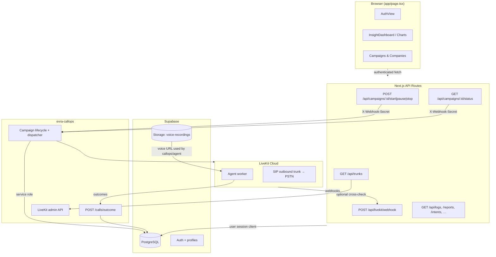

# Agent AVM Interface

Outbound IVR campaign management portal for the South African market. Operators create companies and campaigns, upload contact lists and voice recordings, start outbound dialing, and monitor call outcomes, intent funnels, and spend in real time.

The app is a **Next.js 16** single-page dashboard backed by **Supabase** (PostgreSQL, Auth, Storage). Production outbound dialing is orchestrated by **evra-callops**, which owns campaign lifecycle, pacing, retries, LiveKit SIP dispatch, and agent outcome ingestion. The dashboard proxies lifecycle commands server-side so shared callops credentials never reach the browser.

---

## What this project does

At a high level, Agent AVM connects four concerns:

1. **Campaign operations** — Create and manage companies, campaigns, contact lists, voice prompts, and dialing settings (time windows, speed, transfer targets).
2. **Outbound dialing** — When an operator presses Play/Pause/Stop, the app proxies lifecycle commands to evra-callops. callops dispatches contacts through LiveKit SIP trunks, enforces pacing/retry rules, and writes progress back to Supabase.
3. **Call reporting** — Per-call detail (`call_records`), aggregate campaign counters (`call_logs`), and conversation intent waterfalls (`intent_stats`) feed charts and tables across the dashboard.
4. **Access control & audit** — Invite-only Supabase Auth (password + optional WebAuthn passkeys), role-based UI (`admin` vs `engineer`), and immutable security event logging.



---

## Frontend

The UI is a **client-rendered single page** (`app/page.tsx`) wrapped in MUI theming (`components/Providers.tsx`, `lib/theme.ts`) and EVRA design tokens (`lib/tokens.ts`, `app/globals.css`).

### Shell & navigation

| Component | Role |
|-----------|------|
| `AuthView` | Login gate — password sign-in via Supabase Auth; optional WebAuthn passkey enrollment after first login |
| `Sidebar` / `FloatingNav` / `TopBar` | Primary navigation and layout chrome |
| `TutorialOverlay` | First-run guided tour |

### Main views (selected via sidebar)

| View ID | Component(s) | Purpose |
|---------|--------------|---------|
| `dashboard` | `InsightDashboard`, `KpiStrip`, `InsightCharts` | Control Room — configurable KPI cards, charts, filters by company/campaign/agent/date |
| `sts` | `STSDashboard` | STS-specific metrics view |
| `companies` | Inline in `page.tsx` | Company roster (card/table toggle) |
| `campaigns` | `CampaignModal`, `CampaignActionDialog` | Campaign list, create/edit/reuse/archive, play/pause/stop |
| `reports` | `Charts`, `CampaignDetail` | Aggregate campaign report — outcome donut, funnel, spend |
| `quality` | `CallQuality` | Per-call quality and recording review |
| `security` | `SecurityView` | Security audit log |
| `settings` | `SettingsView` | Read-only telephony configuration note; carrier settings live in LiveKit/callops |
| `profile` | `ProfileView` | User profile and appearance |

### Data loading pattern

After auth, the page polls backend APIs on an interval (`NEXT_PUBLIC_POLL_INTERVAL_MS`, default **15s**):

- `GET /api/campaigns` — campaign list
- `GET /api/campaigns/:id/status` — live callops stats for running/paused campaigns
- `GET /api/reports` — aggregate counters per campaign
- `GET /api/logs` — per-call `call_records`
- `GET /api/intents` — intent waterfall for the selected date
- `GET /api/companies`, `/api/trunks`, `/api/security` — supporting data

Starting, pausing, or stopping a campaign (`updateStatus`) triggers `POST /api/campaigns/:id/start|pause|stop`. When `CALLOPS_URL` or `CALLOPS_WEBHOOK_SECRET` is unset, those POSTs fall back to a local campaign status update for development; `GET /status` reports `{ mode: 'unconfigured' }`.

### Dashboard layout

`lib/useDashboardLayout.ts` and `SaveTemplateDialog` persist custom card order/pin/hide state. Layouts can be saved as `dashboard_templates` rows via `GET/POST /api/dashboard-templates`.

---

## Supabase integration

### Client layers

The app uses three Supabase clients, each for a different trust boundary:

| Client | File | Used by |
|--------|------|---------|
| **Browser** | `utils/supabase/client.ts` | `app/page.tsx`, `AuthView` — `createBrowserClient` with an in-memory auth lock to avoid Web Locks API noise |
| **Server (cookie)** | `utils/supabase/server.ts` | API routes — `createServerClient` reads/writes session cookies |
| **Admin (service role)** | `utils/supabase/admin.ts` | LiveKit webhook and voice URL signing — bypasses RLS; never imported in the browser (`server-only`) |

Session refresh runs in `proxy.ts` → `utils/supabase/middleware.ts` on every matched request (`supabase.auth.getSession()`).

API routes authenticate via `getAuthUser()` (`utils/supabase/auth.ts`), which calls `supabase.auth.getUser()` and returns 401 when unauthenticated.

### Authentication & roles

- **Invite-only**: users are created in the Supabase Dashboard; public sign-up should be disabled.
- On sign-up, trigger `handle_new_user` (`supabase/migrations/20260610120000_profiles_on_signup.sql`) inserts a `profiles` row with role from `raw_user_meta_data.role` (`admin` or `engineer`, default `engineer`).
- `lib/roles.ts` resolves the effective role for UI gating.
- **Passkeys**: after password login, users can register a WebAuthn credential stored in `profiles.passkey_credential`.

### Database schema

Migrations live in `supabase/migrations/` (apply via Supabase CLI or SQL editor). `schema.sql` at the repo root is a consolidated idempotent snapshot of the initial schema.

#### Core entities

| Table | Purpose |
|-------|---------|
| `companies` | Client organizations (`name`, optional `contact_name/email/phone`) |
| `campaigns` | Dialing campaigns — agent persona, status, time window, voice prompt, transfer settings, company link, callops/LiveKit overrides (`sip_trunk_id`, `agent_name`), pacing (`max_retries`, `max_concurrent`, …) |
| `contacts` | Per-campaign dial list — phone, name, status lifecycle (`pending` → `in_progress` → `dialed` / `failed` / `retry`) |
| `profiles` | App user profile linked to `auth.users` — role, passkey credential |
| `voip_providers` | Legacy/provider config table; current Settings UI does not expose carrier CRUD |
| `sip_trunks` | Catalog mapping friendly names → LiveKit trunk IDs (`ST_…`); campaigns store the integer FK in `campaigns.sip_trunk_id` |
| `system_settings` | Global config — IP whitelist, environment label |

#### Call data (two layers)

| Table | Granularity | Consumed by |
|-------|-------------|-------------|
| `call_records` | One row per placed call — `outcome`, `talk_seconds`, `cost`, `recording_url`, `room`, `contact_id`, `egress_id` | Written by callops and LiveKit webhook, read by `GET /api/logs`, Call Quality view, intent denominators |
| `call_logs` | One aggregate row per campaign — rolled-up counters (`dialed`, `connected`, `qualified`, …), CPL, total spend | `GET /api/reports`, campaign report charts |
| `intent_stats` | Daily per-campaign intent reach counts (`intent_name`, `step`, `reached`) | `GET /api/intents`, intent waterfall charts |

The `bump_intent()` SQL function atomically increments intent counters for outcome ingestion.

#### Security & templates

| Table | Purpose |
|-------|---------|
| `security_logs` | Audit trail — login events, campaign execution, config changes |
| `dashboard_templates` | Saved dashboard layouts (`layout` JSONB) |

#### Row-Level Security

All application tables enable RLS with **authenticated-only** policies (broad `USING (true)` for logged-in users). Server-to-server writers such as the LiveKit webhook and evra-callops use service-role credentials to bypass RLS. Never expose `SUPABASE_SERVICE_ROLE_KEY` to the client.

### Storage

Migration `20260612130000_voice_recordings_storage.sql` creates a private `voice-recordings` bucket. Campaigns reference uploaded files via `campaigns.voice_path`. `lib/voice.ts` can mint a short-lived signed URL for the agent when the direct LiveKit CLI path is used; production dispatch is owned by callops.

---

## Callops and LiveKit integration

The app does **not** call Twilio or Telnyx directly. Those providers are configured as **SIP outbound trunks** inside LiveKit Cloud. In production, evra-callops drives LiveKit; this repo keeps LiveKit SDK helpers and `npm run dial` for diagnostics and pre-cutover testing.

### Production lifecycle flow

1. **Operator starts/pauses/stops campaign** — UI calls `POST /api/campaigns/:id/start|pause|stop`.
2. **Lifecycle proxy** (`app/api/campaigns/[id]/[action]/route.ts`) authenticates the user and forwards to `CALLOPS_URL` with `X-Webhook-Secret`.
3. **evra-callops** owns queueing, pacing, retries, LiveKit dispatch, agent outcome ingestion (`POST /calls/outcome`), and writes Supabase state.
4. **Dashboard polling** reads stored state from this app (`/api/campaigns`, `/api/logs`, `/api/reports`, `/api/intents`) and live stats from `GET /api/campaigns/:id/status`.
5. **LiveKit webhooks** (`POST /api/livekit/webhook`) remain enabled as a signed safety net for room lifecycle updates such as connected, `recording_url`, talk time, and no-answer fallback.

### Local fallback

When `CALLOPS_URL` or `CALLOPS_WEBHOOK_SECRET` is unset, lifecycle POSTs update `campaigns.status` directly and return `{ mode: 'local' }`. This keeps campaign controls usable in local development but does not dispatch calls or fabricate call records.

### CLI testing

```bash
npm run callops -- status <campaignId>       # query live callops stats
npm run callops -- start <campaignId>        # lifecycle command through callops
npm run callops -- watch <campaignId>        # compare callops + Supabase progress
npm run dial -- --campaign-id <id> --contact-id <id>  # direct LiveKit diagnostic path
```

### Required environment variables

Copy `.env.local.example` (local) or `.env.example` (production). Key groups:

| Variable | Purpose |
|----------|---------|
| `NEXT_PUBLIC_SUPABASE_URL`, `NEXT_PUBLIC_SUPABASE_PUBLISHABLE_KEY` | Client and server Supabase access |
| `SUPABASE_SERVICE_ROLE_KEY` | LiveKit webhook writes, diagnostic scripts, voice signing (server only) |
| `CALLOPS_URL`, `CALLOPS_WEBHOOK_SECRET` | Production lifecycle proxy, live status, callops trunk cross-check |
| `LIVEKIT_URL`, `LIVEKIT_API_KEY`, `LIVEKIT_API_SECRET` | LiveKit webhook validation and direct diagnostic CLI |
| `LIVEKIT_SIP_OUTBOUND_TRUNK_ID` | Default outbound SIP trunk for direct diagnostic CLI (`ST_…`) |
| `LIVEKIT_AGENT_NAME` | Agent worker dispatch name for direct diagnostic CLI |
| `LIVEKIT_RECORD_*` | Optional S3-compatible egress for call recordings |
| `INWORLD_API_KEY` | Inworld TTS Basic auth credential (base64, server only) for `/api/tts/generate` |
| `AVM_SCRIPT_AUDIO_STORAGE_*` | Supabase S3 credentials + public URL for generated campaign audio (`script-{campaign-slug}-{DD-MM-YYYY}.mp3` via PutObject) |
| `NEXT_PUBLIC_POLL_INTERVAL_MS` | Dashboard refresh interval (default 15000) |

Per-campaign overrides: `campaigns.sip_trunk_id` stores the integer `sip_trunks.id` selected in the campaign wizard. callops resolves that to `sip_trunks.livekit_trunk_id`.

For a deeper file-by-file guide to the LiveKit path, see [docs/livekit-outbound-integration.md](./docs/livekit-outbound-integration.md).

---

## API routes

| Route | Method | Auth | Description |
|-------|--------|------|-------------|
| `/api/campaigns` | GET, POST | User | List / create campaigns |
| `/api/campaigns/:id` | PUT, DELETE | User | Campaign updates / soft delete |
| `/api/campaigns/:id/start` | POST | User | Proxy campaign start to callops; local status fallback when unconfigured |
| `/api/campaigns/:id/pause` | POST | User | Proxy campaign pause to callops; local status fallback when unconfigured |
| `/api/campaigns/:id/stop` | POST | User | Proxy campaign stop to callops; local status fallback when unconfigured |
| `/api/campaigns/:id/status` | GET | User | Proxy live queue/call stats from callops |
| `/api/tts/generate` | POST | User | Generate campaign voice audio via Inworld TTS |
| `/api/tts/save` | POST | User | Save generated script audio to `avm-scripts` (campaign-labeled) |
| `/api/companies` | GET, POST | User | Company management |
| `/api/trunks` | GET | User | SIP trunk catalog for the campaign wizard |
| `/api/logs` | GET | User | Per-call `call_records` |
| `/api/reports` | GET | User | Aggregate `call_logs` |
| `/api/intents` | GET | User | Intent waterfall data |
| `/api/security` | GET | User | Security logs |
| `/api/dashboard-templates` | GET, POST, DELETE | User | Saved dashboard layouts |
| `/api/livekit/webhook` | POST | LiveKit signature | Room lifecycle updates |
| `/api/calls/result` | POST | None | Deprecated no-op; agents should use callops `/calls/outcome` |
| `/api/health` | GET | None | Health check for deploy |

---

## Project structure

```text
app/
  page.tsx              # Main SPA — auth gate, all views, polling, campaign controls
  layout.tsx            # Root layout, MUI Providers, fonts
  globals.css           # EVRA design tokens and global styles
  api/                  # Next.js Route Handlers (see table above)
components/             # UI modules (AuthView, Sidebar, charts, campaign modals, …)
lib/                    # Business logic (outbound-call diagnostics, livekit, voice, roles, …)
types/                  # Shared TypeScript interfaces
utils/supabase/         # Browser, server, admin clients; auth helpers; middleware
supabase/migrations/    # Ordered SQL migrations (source of truth for schema)
scripts/                # dial-outbound CLI, env preload
infrastructure/deploy/  # Docker Compose deploy runbook
docs/                   # Integration guides (LiveKit)
proxy.ts                # Next.js middleware entry — session cookie refresh
schema.sql              # Idempotent initial schema snapshot
```

---

## Setup & development

### 1. Install dependencies

```bash
npm install
```

### 2. Environment

Create `.env.local` from `.env.local.example`:

```env
NEXT_PUBLIC_SUPABASE_URL=https://your-project.supabase.co
NEXT_PUBLIC_SUPABASE_PUBLISHABLE_KEY=your-publishable-key
```

Add callops, LiveKit, and service-role keys when ready for real dialing (see [env table](#required-environment-variables) above). Without callops vars, lifecycle buttons only update local campaign status.

### 3. Database

Apply migrations in order from `supabase/migrations/`, or run `schema.sql` plus subsequent migration files in the Supabase SQL editor.

Create users in **Supabase Dashboard → Authentication → Users** (disable public sign-up).

### 4. Passkeys (optional)

WebAuthn requires HTTPS or `localhost`. For LAN testing, Chrome flag: `chrome://flags/#unsafely-treat-insecure-origin-as-secure`.

### 5. Run

```bash
npm run dev     # http://localhost:3000
npm run build   # production build
npm run start   # production server
```

### 6. Production deploy

Docker Compose + GitHub Actions workflow (`.github/workflows/deploy-agent-avm.yml`). See [infrastructure/deploy/runbook.md](./infrastructure/deploy/runbook.md) for server paths, Cloudflare tunnel, and secrets.

---

## Technology stack

| Layer | Choice |
|-------|--------|
| Framework | Next.js 16 (App Router) |
| UI | React 19, MUI 9, Chart.js, EVRA design tokens |
| Database & Auth | Supabase (PostgreSQL, Auth, Storage, RLS) |
| Telephony | LiveKit Server SDK — agent dispatch + SIP outbound |
| Runtime | Node.js API routes (`runtime = 'nodejs'` on telephony routes) |

---

## Related documentation

| Document | Contents |
|----------|----------|
| [docs/app-api-reference.md](./docs/app-api-reference.md) | Route inventory, auth model, callops/OpenAPI alignment |
| [docs/livekit-outbound-integration.md](./docs/livekit-outbound-integration.md) | Callops + LiveKit operational flow, env vars, testing |
| [docs/voicelist.md](./docs/voicelist.md) | Inworld voice IDs used by the campaign voice generator |
| [infrastructure/deploy/runbook.md](./infrastructure/deploy/runbook.md) | Production deployment on Docker + Cloudflare |
