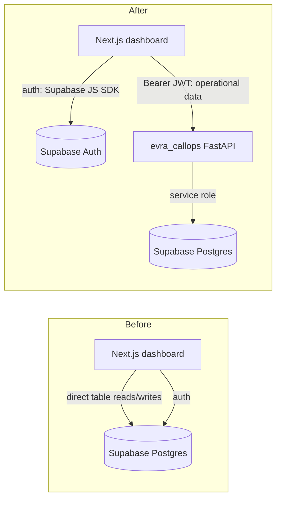

# CallOps Migration — Handover

**Audience:** a developer picking up this codebase for the first time.
**Scope:** the migration of `agent-avm-interface` (Next.js dashboard) off direct Supabase reads/writes and onto the `evra_callops` FastAPI backend, plus the schema cleanup done alongside it.
**As of:** `evra_callops` v0.8.0 / `evra_avm` Supabase project `ytozpjohaphinlsqrxlc`.

---

## 1. TL;DR

- The dashboard (`agent-avm-interface`) used to read/write Supabase tables directly for almost everything. It now goes through `evra_callops`'s HTTP API for all operational data (campaigns, calls, contacts, leads, trunks, dashboards, settings, scripts). **Supabase auth stays in the frontend** — the dashboard still uses `@supabase/supabase-js` for login/session, and forwards the user's Supabase JWT to CallOps as a Bearer token on every API call.
- CallOps validates that JWT itself (ES256 via Supabase's JWKS endpoint) and enforces company-scoped authorization server-side — the frontend no longer relies on Supabase RLS for access control on these tables.
- A parallel effort cleaned up the shared Supabase schema: dropped dead columns/tables, fixed migrations that existed locally but were never applied, added missing `CHECK` constraints, and reconciled a data-model mismatch between what the agent runtime actually writes and what the API/DB thought was valid.
- **CallOps changes are committed** (`evra_callops` commit `0954124`, and earlier). **Frontend changes are NOT yet committed** — see [§8 Git state](#8-git-state) before doing anything else.

---

## 2. Architecture: before vs after



The one Supabase project (`evra_avm`, id `ytozpjohaphinlsqrxlc`) is shared by both repos: `agent-avm-interface` connects to it for auth only (plus a small list of exceptions below), and `evra_callops` owns it as the system of record for everything else.

### 2.1 What still talks to Supabase directly from the frontend (intentional or follow-up)

Not everything moved. These frontend routes still read/write Supabase tables directly — know this before assuming "everything goes through CallOps":

| Route | Table(s) | Why it's still direct |
|---|---|---|
| `app/api/calls/result/route.ts` | `call_records` | Agent-runtime webhook, writes call results as they land. Not yet migrated to a CallOps ingest endpoint. |
| `app/api/livekit/webhook/route.ts` | `call_records` | LiveKit egress/room webhooks, same reasoning. |
| `app/api/security/route.ts` | `security_logs` | Small, low-traffic, never migrated. |
| `app/api/dashboard-templates/route.ts` | `dashboard_templates` | CallOps has an equivalent (`/companies/{id}/dashboard-templates`) that was never wired up here — worth revisiting. |
| `app/api/campaigns/[id]/[action]/route.ts` | `campaigns` (status patch) | Predates the migration; CallOps has `/campaigns/{id}/{start,stop,pause}` — this route should probably be retired in favor of those. |

Everything else under `app/api/` now proxies CallOps via `utils/callops.ts` (`callopsGet` / `callopsPost` / `callopsPatch` / `callopsItems`).

### 2.2 Auth model

- Frontend: `utils/supabase/auth.ts` exposes `getAuthUser()` (cookie-based Supabase client + user, for routes that still touch Supabase directly) and `getAccessToken()` (resolves the Supabase session's `access_token` to forward as a Bearer token to CallOps).
- CallOps: validates the JWT via JWKS (ES256, no shared secret needed — confirmed working against `https://call-center.evra-ai.com/me`). `app/auth/context.py` resolves a profile + company memberships + admin flag from the token, self-provisioning a `profiles` row on first sight if missing (this fixed a real 500 in campaign-lifecycle routes — see `app/routes/campaigns.py::_resolve_lifecycle_caller`).
- Company scoping is enforced **server-side in CallOps** (`assert_company_scope`), not via Supabase RLS from the frontend's perspective anymore.

---

## 3. What moved to CallOps (by feature)

| Feature | Old (Supabase direct) | New (CallOps) | Frontend route |
|---|---|---|---|
| Reports / campaign performance | Local aggregation over `call_records` | `GET /companies/{id}/dashboard/campaign-performance` (fanned out per company, backend-computed `total_cost`) | `app/api/reports/route.ts` |
| Call logs | `call_records` table select | `GET /companies/{id}/calls` (paginated) | `app/api/logs/route.ts` |
| Leads | `contacts`/`call_records` joins | `GET /companies/{id}/leads` (paginated, enriched) | `app/api/leads/route.ts` |
| SIP trunks (list) | `sip_trunks` table select | `GET /companies/{id}/sip-trunks` (fans out + dedupes — a trunk can belong to many companies, see §4) | `app/api/trunks/route.ts` |
| Cost per minute (ZAR) | Hardcoded frontend constant (`lib/callCost.ts`, now deleted) | `GET/PATCH /system-settings` (`cost_per_minute_zar`, admin-only write, cached with TTL server-side) | `app/api/settings/route.ts`, `components/SettingsView.tsx` |
| Call cost | Client-side estimate | Backend-computed `call_records.cost`, using the live `system_settings` rate at outcome time | `components/CostBreakdown.tsx` sums `cost` from records |
| Script text reuse library | `voice_scripts` table (direct Supabase, **now broken** — see §6.1) | `POST/GET /script-library` (global, no company scoping) | `app/api/voice-scripts/route.ts` |
| Per-campaign script history | Existed in CallOps (`script_audio`) but nothing called it | `POST/GET /script-audio` wired into campaign create + edit | `app/api/script-audio/route.ts` (new) |

---

## 4. SIP trunks: single-company FK → many-to-many

Trunks (carrier connections) can be shared across multiple companies (one carrier account routing for several client companies). `sip_trunks.company_id` was a single nullable FK and was frequently `NULL` even for trunks in active use.

- New join table `public.sip_trunk_companies` (migration `20260705030000_sip_trunk_companies.sql`), backfilled twice: once from existing non-null `company_id` values, and again by deriving links from `campaigns.sip_trunk_id` (the real usage signal — this caught actively-dialing trunks the first backfill missed, e.g. trunk id 2 `utility_connect` used by 4 live campaigns for company 10).
- `sip_trunks.company_id` and `sip_trunks.campaign` columns were dropped (`20260705050000_drop_legacy_columns.sql`) once all code paths moved to the join table.
- `app/api/sip_trunks.py` was rewritten around the join table: any linked company can manage a trunk (edit/archive/rotate credentials), and there are new link/unlink endpoints: `POST /companies/{id}/sip-trunks/{trunk_id}/link`, `DELETE .../link`.
- `app/api/campaigns.py::_validate_trunk` was updated to check the join table instead of `sip_trunks.company_id`.
- RLS had to be added retroactively to the new table (`20260705070000_sip_trunk_companies_rls.sql`) — it was flagged by the Supabase linter (`rls_disabled_in_public`) immediately after creation.
- Frontend: `app/api/trunks/route.ts` now fans out over the user's companies (`GET /companies/{id}/sip-trunks` per company) and dedupes by trunk id, since one trunk can appear under several companies.

---

## 5. Schema cleanup (migrations, chronological)

All applied to `evra_avm` (`ytozpjohaphinlsqrxlc`). Files live in `evra_callops/supabase/migrations/`.

| Migration | What it does |
|---|---|
| `20260705010000_system_settings_cost_per_minute.sql` | Adds `system_settings.cost_per_minute_zar` (was a hardcoded constant). |
| `20260705020000_dial_attempt_timings_fixed.sql` | Supersedes an **older local migration that was never applied** (`20260703120000_dial_attempt_timings.sql` referenced `profiles.company_id`, a column that doesn't exist — company membership is via `company_members`). Creates `call_session_timings` for real this time. |
| `20260705030000_sip_trunk_companies.sql` | Creates `sip_trunk_companies` join table + backfill #1 (from `sip_trunks.company_id`). |
| `20260705030001_sip_trunk_companies_backfill_from_campaigns.sql` | Backfill #2, deriving links from `campaigns.sip_trunk_id` (ground truth for actual usage). |
| `20260705040000_rename_voice_scripts_deprecated.sql` | Renames `voice_scripts` → `voice_scripts_deprecated` (thought to be a dead pre-`script_audio` prototype with zero references — **this assumption was wrong for the frontend**, see §6.1). |
| `20260705050000_drop_legacy_columns.sql` | Drops `call_records.agent_outcome`, `call_records.script_path`, `sip_trunks.campaign`, `sip_trunks.company_id` — all confirmed dead via full-repo search first. |
| `20260705060000_baseline_drifted_tables.sql` | No-op `CREATE TABLE IF NOT EXISTS` baseline for 5 tables that existed live with no migration file at all (`intent_stats`, `voice_scripts_deprecated`, `dial_number_state`, `suppression_list`, `product_consent`) — reconciles migration history with reality, doesn't change data. |
| `20260705070000_sip_trunk_companies_rls.sql` | Adds RLS to `sip_trunk_companies` (was missing, flagged by linter). |
| `20260705080000_enum_column_alignment.sql` | **Superseded by the next migration** — see below. |
| `20260705090000_enum_column_alignment_fix_missed_values.sql` | Corrective fix. `20260705080000` narrowed `call_records.outcome`/`business_disposition` `CHECK` constraints based on an audit of `app/` only. A deeper audit of `agent/` (the code that actually writes these columns) found live, tested values that had been missed (`hangup`, `error`, `no_speech`, `callback`, `single_opt_in`, `interested`). This migration widens both constraints to the full, verified set. **If you ever touch these constraints again, audit `agent/call_handler.py`, not just `app/`.** |
| `20260705100000_script_library.sql` | New `script_library` table (global script-text reuse — see §7). |

Also added in the same pass (not schema, but related): `CHECK` constraints on `contacts.network_provider`, `campaigns.routing_mode`, `campaigns.opt_out_key` (part of `20260705080000`/`20260705090000`).

### 5.1 Current valid vocabularies (source of truth: `app/api/lookups.py`, exposed via `/lookups/*`)

- `call_records.outcome`: `answered, connected, no_answer, busy, failed, voicemail, transferred, opted_out, subscribed, lead, hangup, error, no_speech, callback`
- `call_records.business_disposition`: `subscribe, opt_out, lead, callback, single_opt_in, interested, qualified, not_interested`

If the frontend needs to render/filter/style these, check `lib/tokens.ts` (`statusChipTone`) and `types/index.ts` doc comments — both were updated to match.

---

## 6. Script text saving (most recent change)

**Problem this solved:** script text (what the AI voice reads to leads) was only ever persisted transiently — sent to TTS, and only the resulting audio URL saved to the campaign. Text survived only via an ad-hoc frontend→Supabase write (`voice_scripts` table) that fed the "reuse a previous script" bubbles in `components/VoiceGenerator.tsx`. There was no way to reload a campaign's script text when reopening it for editing.

### 6.1 A regression was found and fixed in the same pass

Renaming `voice_scripts` → `voice_scripts_deprecated` (§5, `20260705040000`) was based on an audit of `evra_callops`'s code only, which found zero references. **The frontend was still reading/writing that exact table** (`app/api/tts/save/route.ts`, `app/api/voice-scripts/route.ts`) — the rename silently broke script-text saving for a few hours until this was caught. No data was lost (last real write predated the rename). **Lesson: this Supabase project is shared by two repos — a "confirmed dead" audit must check both before any destructive/renaming migration.**

### 6.2 What was built

- New CallOps table `public.script_library` (global — deliberately **not** company-scoped, matching the old `voice_scripts` behavior; product decision made 2026-07-05) + `POST /script-library`, `GET /script-library` (`app/api/script_library.py`).
- `app/api/tts/save/route.ts` and `app/api/voice-scripts/route.ts` now proxy CallOps instead of writing to Supabase directly.
- New `app/api/script-audio/route.ts` proxies CallOps's pre-existing but previously-unused `script_audio` table (this one IS per-`campaign_id`, unlike the global library).
- `components/VoiceGenerator.tsx` gained `initialText` / `initialVoiceId` (preload on mount) and `onScriptTextChange` (surfaces current text to the parent).
- `components/CampaignModal.tsx` (create flow): after a campaign is created, best-effort saves its script text + audio + voice to `script_audio` for future-edit history.
- `components/CampaignActionDialog.tsx` (edit flow): now reloads the campaign's last-saved script text/voice on open (previously always started blank), and — as a related fix — now actually tracks and sends `voice_id` on edit (it was never wired at all before, meaning editing a campaign's voice never persisted `campaigns.voice_id`, even though the backend and the PUT proxy both already supported it).

`voice_scripts_deprecated` (27 orphaned rows, no `company_id`, unattributable) was deliberately left untouched — product decision was to start the new library fresh rather than migrate/attribute that data.

---

## 7. Known issues / follow-ups for the next developer

1. **Frontend changes are uncommitted** — see §8. Commit or review before they're lost/conflict.
2. **`CampaignUpdate` (CallOps) doesn't accept `company_id` or `start_date`** — the edit dialog silently drops changes to those two fields on save. Pre-existing, not touched in this pass.
3. **Two "reuse script" mechanisms still coexist** and can confuse users: the new `/script-library` (text + voice + audio, global) and the older S3-listing-only `GET /api/scripts` (audio URLs, no text, used in `CampaignActionDialog`'s "reuse as template" mode). Consider consolidating.
4. **`docs/SUPABASE_SCHEMA.md`** (if still present) was already stale before this migration and hasn't been regenerated — don't trust it, check `information_schema` or the migrations folder instead.
5. **A Supabase secret key for a *different* project (`STS_SUPABASE_SECRET_KEY`, project `flaonbqsnnzntgiuowmu`) was pasted into chat** during this work. Confirm it's been rotated if it hasn't already — this is unrelated to `evra_avm` (`ytozpjohaphinlsqrxlc`), it's the separate STS/SDP project.
6. **Routes flagged in §2.1** (`dashboard-templates`, `campaigns/[id]/[action]`) have CallOps equivalents that were never wired up — worth a follow-up pass.
7. If you ever touch `call_records.outcome` / `business_disposition` constraints again: audit `agent/call_handler.py` (the actual writer), not just `app/` — see the corrective migration in §5 for why this matters.

---

## 8. Git state

- **`evra_callops`**: all backend work from this migration is committed to `main` (see commit `0954124` "Update call handling, API endpoints, and documentation for enhanced functionality", and the cost-tracking work in `cc01058` before it). Working tree is clean.
- **`agent-avm-interface`**: work from this migration is **uncommitted** as of this handover. Modified/added/deleted files:

```
 M .env
 M app/api/calls/result/route.ts
 M app/api/campaigns/[id]/contacts/route.ts
 M app/api/campaigns/[id]/route.ts
 M app/api/leads/route.ts
 M app/api/logs/route.ts
 M app/api/reports/route.ts
 M app/api/trunks/route.ts
 M app/api/tts/save/route.ts
 M app/api/voice-scripts/route.ts
 M components/CampaignActionDialog.tsx
 M components/CampaignDetail.tsx
 M components/CampaignModal.tsx
 M components/CostBreakdown.tsx
 M components/SettingsView.tsx
 M components/VoiceGenerator.tsx
 M docs/openapi.json
 D lib/callCost.ts
 M lib/tokens.ts
 M types/index.ts
?? app/api/script-audio/
?? app/api/settings/
```

(`.env` shows as modified locally — double-check nothing sensitive is staged before any commit; it's git-ignored in principle but verify.)

---

## 9. Environment / config reference

Frontend (`agent-avm-interface/.env`) variable names relevant to this migration (values withheld — check `.env` locally, never commit it):

- `CALLOPS_URL`, `CALLOPS_WEBHOOK_SECRET` — CallOps base URL + shared secret for the few routes that use webhook-secret auth instead of a user Bearer token (trunk create/update, campaign detail read-through).
- `NEXT_PUBLIC_SUPABASE_URL`, `NEXT_PUBLIC_SUPABASE_ANON_KEY` / `NEXT_PUBLIC_SUPABASE_PUBLISHABLE_KEY` — Supabase auth only now.
- `SUPABASE_SERVICE_ROLE_KEY` — still used by the handful of routes in §2.1 that write to Supabase directly.
- `AVM_SCRIPT_AUDIO_STORAGE_*` — S3-compatible bucket for script audio file uploads (unrelated to the CallOps migration; still handled entirely in the frontend, `lib/avm-script-storage.ts`).

CallOps (`evra_callops`) needs Supabase service-role credentials, JWKS URL for JWT validation, and LiveKit credentials — see `app/settings.py` for the full list; not duplicated here since it wasn't part of this migration's scope.

---

## 10. How to verify everything still works

```bash
# Backend
cd evra_callops
.venv/bin/python -m pytest -q
# Expect: 363 passed, 29 pre-existing failures (baseline — unrelated to this migration,
# see test names in the pytest output if you want to confirm nothing new broke)

# Frontend
cd agent-avm-interface
npx tsc --noEmit         # typecheck
npx eslint .             # lint
npm run build            # full production build
```

To regenerate the OpenAPI spec after any CallOps API change (both repos keep a copy):

```bash
cd evra_callops
.venv/bin/python -c "
import json
from app.main import create_app
json.dump(create_app().openapi(), open('docs/openapi.json', 'w'), indent=2)
"
cp docs/openapi.json ../agent-avm-interface/docs/openapi.json
```
