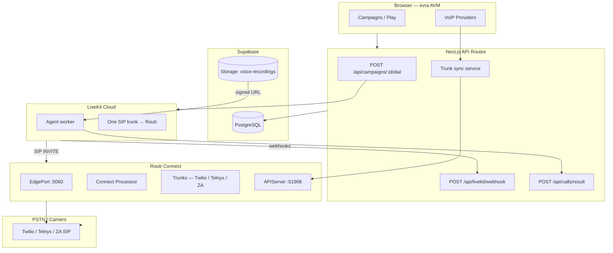
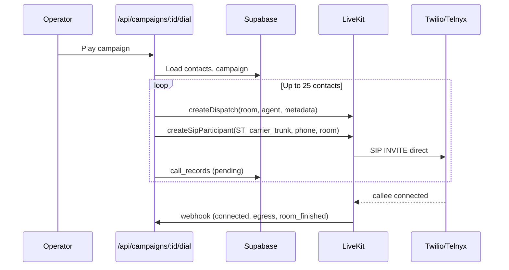
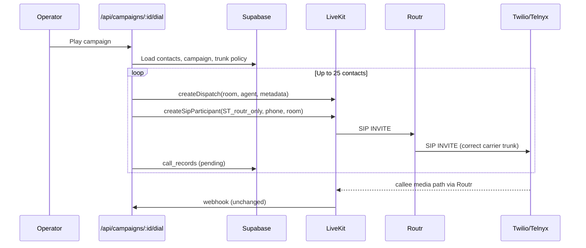

# Routr + LiveKit + evra AVM Integration Guide

> **Purpose:** Move PSTN trunking and SIP routing out of LiveKit Cloud and into Routr, while keeping LiveKit as the agent runtime (workers, rooms, dispatch, recordings). evra AVM remains the business control plane (campaigns, contacts, reporting) backed by Supabase.

**Last updated:** June 2026  
**Audience:** evra AVM developers integrating telephony infrastructure

---

## Table of Contents

1. [Executive Summary](#1-executive-summary)
2. [Target Architecture](#2-target-architecture)
3. [Responsibility Split](#3-responsibility-split)
4. [What Routr Is (and Is Not)](#4-what-routr-is-and-is-not)
5. [Current vs Target Call Flow](#5-current-vs-target-call-flow)
6. [Routr Concepts Reference](#6-routr-concepts-reference)
7. [Deployment Options](#7-deployment-options)
8. [Routr Configuration](#8-routr-configuration)
9. [LiveKit Cloud Configuration](#9-livekit-cloud-configuration)
10. [evra AVM Code Changes](#10-evra-avm-code-changes)
11. [Supabase Schema & Data Sync](#11-supabase-schema--data-sync)
12. [Environment Variables](#12-environment-variables)
13. [Outbound IVR Dial Sequence](#13-outbound-ivr-dial-sequence)
14. [Inbound Calls (Future)](#14-inbound-calls-future)
15. [South African Market Notes](#15-south-african-market-notes)
16. [Testing Checklist](#16-testing-checklist)
17. [Phased Rollout Plan](#17-phased-rollout-plan)
18. [Risks & Limitations](#18-risks--limitations)
19. [FAQ](#19-faq)
20. [Reference Links](#20-reference-links)

---

## 1. Executive Summary

### Goal

1. **LiveKit Cloud** hosts registered AI agent workers (unchanged).
2. **LiveKit** has **one SIP trunk** connected to **Routr** (not directly to Twilio/Telnyx).
3. **Routr** owns carrier SIP trunks, credentials, DID routing, and PSTN dispatch.
4. **evra AVM** (Next.js + Supabase) continues to manage campaigns and orchestrate calls via LiveKit APIs, with a new sync layer to Routr for trunk configuration.

### What changes for operators

- Nothing visible in the campaign UI if implemented correctly.
- VoIP provider settings in evra still exist; they sync to Routr instead of (or in addition to) LiveKit trunk APIs.

### What changes for developers

| Area | Change |
|------|--------|
| Carrier credentials | Stored in Routr Trunks; synced from `voip_providers` |
| `sip_trunks` table | Maps to Routr trunk refs, not LiveKit `ST_…` IDs |
| `LIVEKIT_SIP_OUTBOUND_TRUNK_ID` | Single trunk pointing at Routr |
| `placeOutboundCall()` | Same API calls; different trunk target |
| LiveKit webhooks / agent callbacks | Unchanged |
| Simulator mode | Unchanged |

---

## 2. Target Architecture



### Network path (outbound IVR)

```
evra dial API
  → LiveKit createDispatch (agent joins room)
  → LiveKit createSipParticipant (single trunk → Routr)
  → Routr peer-to-pstn (selects carrier trunk)
  → Twilio/Telnyx/ZA carrier
  → callee phone
```

---

## 3. Responsibility Split

| Concern | Routr | LiveKit | evra AVM + Supabase |
|---------|:-----:|:-------:|:-------------------:|
| Twilio/Telnyx/carrier SIP credentials | ✅ | ❌ | UI + sync |
| Multi-trunk / per-campaign carrier selection | ✅ | ❌ | `sip_trunks`, `campaigns.sip_trunk_id` |
| Outbound PSTN SIP routing | ✅ | ❌ | Dial orchestration |
| Inbound DID routing | ✅ | ❌ | Number provisioning UI (future) |
| AI agent workers | ❌ | ✅ | `agent_name`, metadata |
| Room creation | ❌ | ✅ | `placeOutboundCall()` |
| `createDispatch()` | ❌ | ✅ | `lib/outbound-call.ts` |
| `createSipParticipant()` | ❌ | ✅ | Same call, trunk → Routr |
| Call webhooks | ❌ | ✅ | `/api/livekit/webhook` |
| Room egress / recordings | ❌ | ✅ | `startRoomRecording()` |
| Agent outcome + intents | ❌ | ❌ | `/api/calls/result` |
| Campaigns, contacts, reporting | ❌ | ❌ | Supabase |
| Campaign operations UI | ❌ | ❌ | Next.js dashboard |

### Critical rule

> **Routr replaces LiveKit as the SIP gateway to PSTN.**  
> **LiveKit keeps agent runtime, rooms, and media.**  
> **evra orchestrates both.**

---

## 4. What Routr Is (and Is Not)

### Routr IS

- Lightweight **SIP proxy**, **registrar**, and **location server**
- Cloud-native (Docker / Kubernetes / `routr-one` all-in-one image)
- **Connect Mode** — SIP Connect standard with Domains, Agents, Peers, Trunks, Numbers, ACLs
- Programmable via **`@routr/sdk`** (Node.js) and **`@routr/ctl`** (CLI)
- Postgres-backed config (`pgdata`) with `extended` JSON for custom metadata

### Routr IS NOT

- A media server (no RTP unless you add RTPEngine middleware)
- A replacement for LiveKit agent dispatch or rooms
- A WebRTC platform for AI agents (WebRTC support is for SIP softphones, not LiveKit rooms)
- Integrated with Supabase or LiveKit APIs out of the box
- A call analytics / CDR / webhook platform (needs custom middleware)

### Routr core components

| Component | Role |
|-----------|------|
| **EdgePort** | Receives SIP on :5060 (UDP/TCP/TLS/WS) |
| **Dispatcher** | Routes SIP messages to processors |
| **Connect Processor** | Authentication, routing logic (agent-to-agent, from-pstn, peer-to-pstn, etc.) |
| **Location Service** | Tracks registered endpoints (peers, agents) |
| **APIServer (pgdata)** | gRPC/HTTP API for trunk/number/peer config (:51908) |
| **Registry** | Outbound trunk registration to carriers |

### Routing directions (Connect Processor)

| Direction | When |
|-----------|------|
| `from-pstn` | Carrier calls a DID (callee is a Number) |
| `peer-to-pstn` | LiveKit (Peer) dials an external phone number |
| `agent-to-pstn` | Registered SIP agent dials PSTN |
| `agent-to-peer` | Agent calls backend (e.g. LiveKit) |
| `agent-to-agent` | Internal extension dialing |

**evra outbound IVR uses:** `peer-to-pstn` (LiveKit → Routr → carrier).

---

## 5. Current vs Target Call Flow

### Current (today)



### Target (with Routr)



### What stays identical

- Room naming: `avm_<campaignId>_<contactId>_<random>`
- Agent dispatch metadata (voice URL, campaign context)
- `POST /api/livekit/webhook` handlers
- `POST /api/calls/result` + `bump_intent()`
- Simulator fallback when LiveKit env missing
- Dashboard polling, `call_records`, `call_logs`, `intent_stats`

---

## 6. Routr Concepts Reference

### Resource types

#### Domain
SIP realm for registered agents (optional for pure outbound IVR; useful if you add WebRTC operator phones later).

```yaml
apiVersion: v2beta1
kind: Domain
ref: domain-evra
metadata:
  name: EVRA Domain
spec:
  context:
    domainUri: sip.evra.local
```

#### Peer — LiveKit Cloud
LiveKit is a trusted backend SIP server.

```yaml
apiVersion: v2beta1
kind: Peer
ref: peer-livekit
metadata:
  name: LiveKit Cloud SIP
spec:
  aor: sip:livekit@evra.local
  username: livekit
  credentialsRef: cred-livekit-peer
  contactAddr: "<livekit-sip-host>:5060"   # static if LiveKit won't REGISTER
  loadBalancing:
    algorithm: round-robin
    withSessionAffinity: false
```

> Use `contactAddr` when LiveKit receives SIP but does not send REGISTER to Routr.

#### Trunk — Carrier (Twilio/Telnyx/ZA)
One trunk per carrier connection (or per region/account).

```yaml
apiVersion: v2beta1
kind: Trunk
ref: trunk-telnyx-za
metadata:
  name: Telnyx South Africa
  region: za
spec:
  inbound:
    uri: telnyx-za.evra.local
    accessControlListRef: acl-telnyx
  outbound:
    sendRegister: false
    credentialsRef: cred-telnyx
    uris:
      - uri:
          host: sip.telnyx.com
          port: 5060
          transport: udp
        enabled: true
  extended:
    evraProviderId: "<uuid from voip_providers>"
    evraTrunkKey: "telnyx-za"
```

#### Number — DID (inbound, future)
Maps inbound DID to LiveKit with optional headers for room/campaign routing.

```yaml
apiVersion: v2beta1
kind: Number
ref: number-main
metadata:
  name: "+27 XX XXX XXXX"
spec:
  trunkRef: trunk-telnyx-za
  location:
    telUrl: tel:+27XXXXXXXXX
    aorLink: sip:livekit@evra.local
    extraHeaders:
      - name: X-Room-Prefix
        value: inbound-
```

#### ACL
Restrict carrier SIP to known IPs.

```yaml
apiVersion: v2beta1
kind: AccessControlList
ref: acl-telnyx
metadata:
  name: Telnyx IPs
spec:
  accessControlList:
    allow:
      - "<telnyx-sip-cidr>"
    deny:
      - 0.0.0.0/0
```

#### Credentials

```yaml
apiVersion: v2beta1
kind: Credentials
ref: cred-telnyx
metadata:
  name: Telnyx SIP Auth
spec:
  credentials:
    username: "<sip-username>"
    password: "<sip-password>"
```

---

## 7. Deployment Options

### Option A — Quick start (recommended for dev)

Single container with bundled Postgres:

```yaml
# docker-compose.routr.yaml
services:
  routr:
    image: fonoster/routr-one:latest
    environment:
      EXTERNAL_ADDRS: ${ROUTR_PUBLIC_IP}
    ports:
      - "51908:51908"   # APIServer (SDK/CTL)
      - "5060:5060/udp" # SIP
      - "5060:5060/tcp"
    restart: unless-stopped
```

```bash
ROUTR_PUBLIC_IP=<your-public-ip> docker compose -f docker-compose.routr.yaml up -d
```

### Option B — Production Kubernetes

```bash
helm repo add routr https://routr.io/charts
kubectl create namespace routr
helm install evra-routr routr/routr-connect --namespace routr
```

Includes: EdgePort, Connect, Dispatcher, Location, pgdata (Postgres), Redis, Registry.

### Option C — Microservices (from routr repo)

Use `compose.yaml` in the Routr repo for full control over each service.

### Dependencies

| Dependency | Required | Notes |
|------------|----------|-------|
| PostgreSQL | Yes (Connect mode) | Bundled in `routr-one` and Helm chart |
| Redis | Yes (Connect mode) | Bundled in Helm chart |
| RTPEngine | Optional | Only if mixing WebRTC SIP clients with PSTN; **not needed for LiveKit agents** |

### Firewall / ports

| Port | Protocol | Purpose |
|------|----------|---------|
| 5060 | UDP/TCP | SIP signaling |
| 5061 | TCP | SIP TLS (optional) |
| 51908 | TCP | Routr APIServer (SDK/CTL) |
| RTP | UDP | Media (carrier ↔ LiveKit, may traverse Routr or direct depending on topology) |

> Confirm RTP path with your carrier and LiveKit docs. Routr is signaling-only by default; media may flow directly between LiveKit and carrier once session is established.

---

## 8. Routr Configuration

### Step 1 — Install management tools

```bash
npm install -g @routr/ctl
# In evra backend:
npm install @routr/sdk
```

### Step 2 — Bootstrap resources (CLI)

```bash
export ROUTR_API=insecure://<routr-host>:51908

rctl credentials create --insecure
rctl acls create --insecure
rctl peers create --insecure      # LiveKit peer
rctl trunks create --insecure     # One per carrier
```

### Step 3 — Programmatic management (SDK)

Create `lib/routr/client.ts` in evra:

```typescript
import { Trunks, Peers, Credentials, Numbers } from "@routr/sdk";

const endpoint = process.env.ROUTR_API_ENDPOINT!; // e.g. insecure://routr.example.com:51908

export const routrTrunks = new Trunks({ endpoint });
export const routrPeers = new Peers({ endpoint });
export const routrCredentials = new Credentials({ endpoint });
export const routrNumbers = new Numbers({ endpoint });
```

### Step 4 — Sync from voip_providers

When admin saves a provider in Settings:

```typescript
// Pseudocode — lib/routr/sync-provider.ts
async function syncVoipProviderToRoutr(provider: VoipProvider) {
  const cred = await routrCredentials.createCredentials({
    name: `${provider.name} credentials`,
    username: provider.sip_username,
    password: provider.sip_password,
    extended: { evraProviderId: provider.id },
  });

  const trunk = await routrTrunks.createTrunk({
    name: provider.name,
    inbound: {
      uri: `${provider.slug}.evra.local`,
      accessControlListRef: process.env.ROUTR_DEFAULT_ACL_REF,
    },
    outbound: {
      sendRegister: provider.send_register ?? false,
      credentialsRef: cred.ref,
      uris: [{
        host: provider.sip_host,
        port: provider.sip_port ?? 5060,
        transport: "UDP",
        enabled: true,
      }],
    },
    extended: {
      evraProviderId: provider.id,
      evraProviderType: provider.type, // twilio | telnyx | sangoma
    },
  });

  // Upsert sip_trunks row with routr ref instead of ST_ id
  return trunk.ref;
}
```

### Step 5 — Campaign trunk resolution at dial time

**Option A — Header-based (recommended for multi-trunk)**

Pass a SIP header from LiveKit → Routr telling Routr which carrier trunk to use. Configure LiveKit `createSipParticipant` options to include custom headers (verify LiveKit SDK support for your version).

Routr `peer-to-pstn` uses `DOD_NUMBER` header for destination; trunk selection uses Number lookup or custom processor logic.

**Option B — One Routr trunk per campaign (simpler)**

Map `campaigns.sip_trunk_id` → Routr `Trunk.ref`. At dial time, ensure the INVITE from LiveKit carries enough info for Routr to select the trunk (may require custom Routr middleware or per-campaign Numbers).

**Option C — Single carrier initially**

One Twilio/Telnyx trunk in Routr; all campaigns use the same carrier. Simplest migration path.

### extended metadata convention

Store evra IDs on Routr entities for bidirectional sync:

```json
{
  "evraProviderId": "uuid",
  "evraTrunkKey": "telnyx-za",
  "evraCompanyId": "uuid",
  "syncedAt": "2026-06-15T12:00:00Z"
}
```

---

## 9. LiveKit Cloud Configuration

### Agents (unchanged)

- Register agent worker with name matching `LIVEKIT_AGENT_NAME` / `campaigns.agent_name`
- Worker receives dispatch metadata (voice URL, campaign id, etc.)
- Worker POSTs results to `/api/calls/result`

### Outbound SIP trunk — ONE trunk to Routr

Create via LiveKit CLI or Cloud dashboard:

| Field | Value |
|-------|-------|
| Name | `evra-routr-outbound` |
| Address | `<ROUTR_PUBLIC_HOST>:5060` |
| Transport | UDP or TCP (match Routr EdgePort) |
| Auth | Username/password matching Routr Peer credentials (if required) |
| Numbers | `*` or your outbound caller ID pool |

**Save the trunk ID** as `LIVEKIT_SIP_OUTBOUND_TRUNK_ID` (still `ST_…` format — this is the LiveKit-side trunk *to Routr*, not to the carrier).

### Inbound SIP trunk (future)

| Field | Value |
|-------|-------|
| Allowed addresses | Routr public IP(s) only |
| Numbers | Your DID pool or `[]` with auth |
| Dispatch rule | Header-based or catch-all to agent |

### Dispatch rules

Simplify LiveKit dispatch rules — Routr handles carrier selection:

- **Outbound:** LiveKit receives `createSipParticipant`; no dispatch rule needed for outbound.
- **Inbound (future):** One rule matching `X-Campaign-Id` or `X-Room-Name` headers injected by Routr.

### Remove from LiveKit

After migration, **delete or disable** direct Twilio/Telnyx SIP trunks in LiveKit Cloud. Carrier credentials should exist only in Routr.

---

## 10. evra AVM Code Changes

### Files likely to change

| File | Change |
|------|--------|
| `lib/outbound-call.ts` | Trunk ID always = single Routr-facing LK trunk; optional headers for Routr routing |
| `lib/livekit.ts` / trunk resolver | `resolveTrunkId()` returns Routr-facing `ST_…` ID, not per-carrier LK trunk |
| `app/api/campaigns/[id]/dial/route.ts` | Minimal — trunk resolution logic |
| `app/api/providers/route.ts` | Add Routr sync on PUT |
| `lib/routr/` (new) | SDK client, sync helpers |
| `.env.local.example` | Add `ROUTR_*` vars |
| `sip_trunks` usage | Store `routr_trunk_ref` instead of/alongside `ST_…` |

### `resolveTrunkId()` — target behavior

```typescript
// BEFORE: campaign.sip_trunk_id → LiveKit ST_ carrier trunk
// AFTER:  campaign.sip_trunk_id → Routr trunk ref (for routing policy)
//         actual SIP participant always uses LIVEKIT_SIP_OUTBOUND_TRUNK_ID (→ Routr)

function resolveLiveKitTrunkId(): string {
  // Always the single LiveKit trunk pointing at Routr
  return process.env.LIVEKIT_SIP_OUTBOUND_TRUNK_ID!;
}

function resolveRoutrTrunkRef(campaign: Campaign): string | null {
  if (campaign.sip_trunk_id) {
    // Lookup sip_trunks.routr_ref where id or key = campaign.sip_trunk_id
    return lookupRoutrRef(campaign.sip_trunk_id);
  }
  return process.env.ROUTR_DEFAULT_TRUNK_REF ?? null;
}
```

### `placeOutboundCall()` — target behavior

```typescript
async function placeOutboundCall(params: PlaceCallParams) {
  const room = `avm_${params.campaignId}_${params.contactId}_${randomId()}`;
  const routrTrunkRef = resolveRoutrTrunkRef(params.campaign);

  // 1. Dispatch agent (UNCHANGED)
  await agentDispatchClient.createDispatch(room, params.agentName, {
    metadata: JSON.stringify({
      ...params.metadata,
      routrTrunkRef,           // agent can log which carrier path was intended
      voiceUrl: params.voiceUrl,
      campaignId: params.campaignId,
      contactId: params.contactId,
    }),
  });

  // 2. Dial callee via LiveKit → Routr (CHANGED: single trunk)
  await sipClient.createSipParticipant(
    process.env.LIVEKIT_SIP_OUTBOUND_TRUNK_ID!,  // always Routr-facing
    params.phoneNumber,
    room,
    {
      // If LiveKit supports custom SIP headers on outbound participant:
      // headers: { "X-Routr-Trunk-Ref": routrTrunkRef }
    }
  );

  return { room };
}
```

### Simulator — unchanged

When `LIVEKIT_URL` + trunk not configured, `/dial` returns `{ mode: 'unconfigured' }` and UI uses `/api/simulate`. Routr is not involved in simulator mode.

### New API route (optional)

`POST /api/routr/sync` — admin-only, re-syncs all `voip_providers` → Routr. Useful after Routr redeploy or disaster recovery.

---

## 11. Supabase Schema & Data Sync

### Recommended schema additions

```sql
-- Migration: add Routr refs to sip_trunks
ALTER TABLE sip_trunks
  ADD COLUMN IF NOT EXISTS routr_trunk_ref TEXT,
  ADD COLUMN IF NOT EXISTS routr_synced_at TIMESTAMPTZ;

-- Optional: track Routr peer ref globally in system_settings
-- key: routr_livekit_peer_ref
```

### `sip_trunks` table — new semantics

| Column | Before | After |
|--------|--------|-------|
| `name` | Friendly name | Friendly name (unchanged) |
| `trunk_id` | LiveKit `ST_…` | **Deprecated** or LiveKit Routr trunk `ST_…` only |
| `routr_trunk_ref` | — | Routr `Trunk.ref` UUID for carrier |

### `voip_providers` — sync target

On save, evra backend writes to Routr:

| Supabase field | Routr entity |
|----------------|--------------|
| `sip_username` / `sip_password` | `Credentials` |
| `sip_host` / `sip_port` | `Trunk.outbound.uris` |
| `type` (twilio/telnyx) | `Trunk.extended.evraProviderType` |
| `id` | `Trunk.extended.evraProviderId` |

### `campaigns.sip_trunk_id`

- **Before:** LiveKit carrier trunk `ST_…`
- **After:** Reference to `sip_trunks.id` or `sip_trunks.routr_trunk_ref` for carrier selection at Routr layer

### Tables unchanged

- `call_records`, `call_logs`, `intent_stats` — no schema change
- `contacts` — no change
- LiveKit webhooks — no change

### Sync direction

```
Supabase (source of truth for business config)
    → evra API (on save + periodic reconcile job)
    → Routr APIServer (SIP routing config)

LiveKit Cloud (source of truth for runtime)
    → webhooks → Supabase (call state)
```

**Do not** point Routr pgdata at Supabase Postgres directly unless you deliberately colocate schemas. Keep separate databases with an explicit sync layer.

---

## 12. Environment Variables

### New — Routr

| Variable | Purpose | Example |
|----------|---------|---------|
| `ROUTR_API_ENDPOINT` | SDK/CTL endpoint | `insecure://routr.example.com:51908` |
| `ROUTR_PUBLIC_HOST` | SIP host LiveKit trunk points to | `sip.evra.example.com` |
| `ROUTR_PUBLIC_IP` | For `EXTERNAL_ADDRS` in Routr deploy | `203.0.113.10` |
| `ROUTR_DEFAULT_TRUNK_REF` | Default carrier trunk UUID | `a1b2c3d4-…` |
| `ROUTR_DEFAULT_ACL_REF` | Default ACL for carrier trunks | `e5f6g7h8-…` |
| `ROUTR_LIVEKIT_PEER_REF` | LiveKit peer ref in Routr | optional |

### Changed — LiveKit

| Variable | Before | After |
|----------|--------|-------|
| `LIVEKIT_SIP_OUTBOUND_TRUNK_ID` | Carrier trunk `ST_…` | **Single trunk to Routr** `ST_…` |

### Unchanged

| Variable | Purpose |
|----------|---------|
| `LIVEKIT_URL` | LiveKit API |
| `LIVEKIT_API_KEY` / `LIVEKIT_API_SECRET` | Server SDK auth |
| `LIVEKIT_AGENT_NAME` | Worker dispatch name |
| `LIVEKIT_RECORD_*` | Egress to S3 |
| `AGENT_RESULT_SECRET` | Agent callback auth |
| All `NEXT_PUBLIC_SUPABASE_*` | Unchanged |

### `.env.local.example` additions

```env
# Routr SIP router (carriers connect here, not LiveKit)
ROUTR_API_ENDPOINT=insecure://localhost:51908
ROUTR_PUBLIC_HOST=localhost
ROUTR_DEFAULT_TRUNK_REF=

# LiveKit — single outbound trunk pointing at Routr
LIVEKIT_SIP_OUTBOUND_TRUNK_ID=ST_xxxxxxxx   # LiveKit trunk → Routr only
```

---

## 13. Outbound IVR Dial Sequence

### Detailed step-by-step

1. Operator sets campaign status to `running` in UI.
2. UI calls `POST /api/campaigns/:id/dial`.
3. API loads campaign, resolves `routrTrunkRef` from `sip_trunk_id` / default.
4. API loads up to 25 `pending` contacts.
5. For each contact:
   a. Generate room name `avm_<campaignId>_<contactId>_<random>`.
   b. Sign voice recording URL from Supabase Storage.
   c. `AgentDispatchClient.createDispatch(room, agentName, { metadata })`.
   d. `SipClient.createSipParticipant(LIVEKIT_ROUTR_TRUNK_ID, e164Phone, room)`.
   e. Insert `call_records` row (`outcome: pending`, `room`).
   f. Update `contacts.status` → `in_progress`.
6. LiveKit agent worker receives dispatch, joins room, plays IVR.
7. LiveKit SIP module sends INVITE to **Routr** for callee number.
8. Routr classifies: caller = **Peer** (LiveKit), callee = unknown number → **peer-to-pstn**.
9. Routr selects carrier **Trunk** (default or per-campaign policy).
10. Routr sends INVITE to Twilio/Telnyx with correct auth and caller ID.
11. Callee answers → media bridges into LiveKit room → agent converses.
12. LiveKit fires webhooks → `/api/livekit/webhook` updates `call_records`.
13. Agent POSTs `/api/calls/result` → outcomes, intents, cost.

### Pacing / concurrency

- `campaigns.max_concurrent` — still enforced in evra dial route before calling LiveKit.
- Routr handles SIP routing only; it does not limit concurrent campaigns (carrier limits still apply).

---

## 14. Inbound Calls (Future)

When adding inbound DIDs:

1. Configure DID on carrier → points to **Routr** (not LiveKit).
2. Create Routr `Number` for each DID:
   - `telUrl: tel:+27…`
   - `aorLink: sip:livekit@evra.local`
   - `extraHeaders` for campaign/queue routing
3. LiveKit inbound trunk accepts only from Routr IP.
4. LiveKit dispatch rule routes by header to appropriate agent/room.

evra can provision Numbers via `@routr/sdk` when admin assigns DIDs to companies.

---

## 15. South African Market Notes

- Confirm E.164 formatting (`+27…`) — Routr supports `ENFORCE_E164` on Numbers.
- ZA carriers (Telnyx ZA, Twilio ZA, Sangoma, local SIP providers) each become a Routr **Trunk**.
- Caller ID regulations: configure per-trunk outbound identity in Routr trunk auth / P-Asserted-Identity handling.
- Latency: deploy Routr in a region close to both LiveKit SIP edge and ZA carrier POPs.
- Cost tracking in evra (`call_records.cost`) remains agent-reported; Routr does not provide billing APIs.

---

## 16. Testing Checklist

### Phase 1 — Routr standalone

- [ ] Routr container running, `docker ps` shows healthy
- [ ] `rctl domains create --insecure` succeeds
- [ ] Carrier trunk created in Routr
- [ ] LiveKit peer created with `contactAddr`
- [ ] SIP OPTIONS/INVITE from test tool reaches EdgePort :5060

### Phase 2 — LiveKit → Routr

- [ ] LiveKit outbound trunk created pointing at Routr
- [ ] `npm run dial` with single test number
- [ ] INVITE visible in Routr logs
- [ ] Call reaches handset; audio both ways

### Phase 3 — evra integration

- [ ] `voip_providers` save syncs to Routr
- [ ] Campaign play triggers real call via new path
- [ ] `call_records` updates via webhooks
- [ ] Agent `/api/calls/result` works
- [ ] Intent waterfall increments

### Phase 4 — Regression

- [ ] Simulator still works without LiveKit env
- [ ] Multi-campaign concurrent dialing
- [ ] Campaign `sip_trunk_id` selects correct carrier
- [ ] Recording egress still uploads to S3

### Debug tools

- Routr logs: container stdout / `kubectl logs`
- SIP tracing: sngrep pointed at Routr :5060
- LiveKit Cloud dashboard: SIP call logs
- evra: `GET /api/logs` for per-call state

---

## 17. Phased Rollout Plan

### Phase 0 — Documentation & env (1 day)
- Add this doc to `docs/`
- Add `ROUTR_*` env vars to `.env.local.example`
- Deploy Routr to dev/staging

### Phase 1 — Single carrier, no UI change (3–5 days)
- One Telnyx/Twilio trunk in Routr
- One LiveKit trunk → Routr
- Hardcode `LIVEKIT_SIP_OUTBOUND_TRUNK_ID`
- Verify `npm run dial` and one campaign call

### Phase 2 — Provider sync (3–5 days)
- `lib/routr/sync-provider.ts`
- Update `PUT /api/providers` to sync credentials
- Migrate `sip_trunks` schema

### Phase 3 — Per-campaign trunk selection (2–3 days)
- `resolveRoutrTrunkRef()` in dial route
- Header or middleware for Routr trunk picking
- Settings UI shows sync status

### Phase 4 — Production hardening (ongoing)
- TLS on SIP (5061)
- Helm/K8s for Routr
- Monitoring, ACL hardening
- Inbound DIDs if needed

---

## 18. Risks & Limitations

| Risk | Mitigation |
|------|------------|
| RTP/media path issues | Test early; add RTPEngine only if needed |
| LiveKit custom SIP headers unsupported | Use single carrier initially; or custom Routr processor |
| Dual config drift (Supabase vs Routr) | Reconcile job + `routr_synced_at` column |
| Routr not a HA story out of box | Use Helm chart with multiple EdgePort replicas |
| No call events from Routr to evra | Keep LiveKit webhooks as source of truth |
| `peer-to-agent` routing unsupported in Routr | Don't route PSTN inbound to specific agents via Routr; use LiveKit dispatch rules |
| Carrier SIP IP changes | Update Routr ACLs; document provider change process |

---

## 19. FAQ

### Can Routr replace LiveKit agent dispatch?
**No.** `createDispatch()` and room lifecycle stay in LiveKit.

### Can we manage all trunks only in Routr UI?
**Routr has no web UI.** Manage via evra Settings → sync to Routr, or use `rctl`/SDK directly.

### Do we still need `sip_trunks` in Supabase?
**Yes**, as evra's catalog and mapping layer (`routr_trunk_ref`). It no longer stores per-carrier LiveKit `ST_` IDs.

### Does the simulator need Routr?
**No.** Simulator bypasses LiveKit entirely.

### Can LiveKit agents register as Routr workers?
**No.** Agents are LiveKit workers. LiveKit SIP is a Routr **Peer**.

### WebRTC via Routr for agents?
**No benefit** for this architecture. Agents use LiveKit WebRTC internally.

### What about `voip_providers` storing Twilio/Vonage/Sangoma creds?
Keep the table; add sync to Routr on save. Optionally stop writing carrier creds to LiveKit.

---

## 20. Reference Links

| Resource | URL |
|----------|-----|
| Routr docs | https://routr.io/docs |
| Routr GitHub | https://github.com/fonoster/routr |
| Routr SDK (npm) | https://www.npmjs.com/package/@routr/sdk |
| Routr CTL (npm) | https://www.npmjs.com/package/@routr/ctl |
| Routr Helm charts | https://routr.io/charts |
| LiveKit SIP trunk setup | https://docs.livekit.io/telephony/start/sip-trunk-setup/ |
| LiveKit outbound calls | https://docs.livekit.io/telephony/making-calls/outbound-calls/ |
| LiveKit SipClient SDK | https://docs.livekit.io/server-sdk-js/classes/SipClient.html |
| evra internal doc | `docs/livekit-outbound-integration.md` |

---

## Appendix A — Routr SDK quick reference

```typescript
import SDK from "@routr/sdk";

const client = { endpoint: process.env.ROUTR_API_ENDPOINT! };

// Create carrier trunk
const trunks = new SDK.Trunks(client);
await trunks.createTrunk({ /* see Section 6 */ });

// Create LiveKit peer
const peers = new SDK.Peers(client);
await peers.createPeer({
  name: "LiveKit Cloud",
  aor: "sip:livekit@evra.local",
  username: "livekit",
  credentialsRef: "<cred-ref>",
  contactAddr: "sip.livekit.cloud:5060",
});

// Create DID (inbound)
const numbers = new SDK.Numbers(client);
await numbers.createNumber({
  name: "+27...",
  telUrl: "tel:+27...",
  trunkRef: "<trunk-ref>",
  aorLink: "sip:livekit@evra.local",
  extraHeaders: [{ name: "X-Campaign-Id", value: "..." }],
  extended: { evraCompanyId: "..." },
});
```

## Appendix B — Docker Compose (evra + Routr sidecar)

```yaml
# Add to infrastructure/deploy/docker-compose.yml (conceptual)
services:
  routr:
    image: fonoster/routr-one:latest
    environment:
      EXTERNAL_ADDRS: ${ROUTR_PUBLIC_IP}
    ports:
      - "51908:51908"
      - "5060:5060/udp"
    networks:
      - evra-net

  agent-avm:
    # existing evra service
    environment:
      ROUTR_API_ENDPOINT: insecure://routr:51908
      LIVEKIT_SIP_OUTBOUND_TRUNK_ID: ${LIVEKIT_SIP_OUTBOUND_TRUNK_ID}
    depends_on:
      - routr
```

---

*End of integration guide.*
